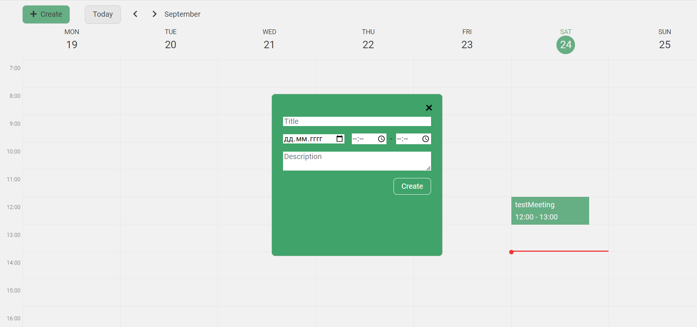

# Calendar-React

***[Site link Netlify](https://roaring-gumdrop-108f06.netlify.app)***

**_To build project use command:_**

- _npm run build_ - in production mode
- _npm start_ - in development mode

#### **The tech stack is:**

- [HTML5](https://en.wikipedia.org/wiki/HTML5)
- [CSS3](https://en.wikipedia.org/wiki/CSS)
- [BEM methodology](https://en.bem.info/methodology/)
- [Flexbox](https://en.wikipedia.org/wiki/CSS_Flexible_Box_Layout)
- [Sass (Scss)](https://sass-lang.com/)
- [JavaScript](https://developer.mozilla.org/ru/docs/Web/JavaScript)
- [Fetch API](https://developer.mozilla.org/en-US/docs/Web/API/Fetch_API)
- [React](https://reactjs.org/)
- [React-Hooks](https://reactjs.org/docs/hooks-faq.html#gatsby-focus-wrapper)
- [JSX](https://reactjs.org/docs/introducing-jsx.html)
- [webpack](https://webpack.js.org/)
- [Babel](https://babeljs.io/)
- [ESLint](https://eslint.org/)
- [prettier](https://prettier.io/)

#### Author

- ##### Anna Zubenko

# Calendar-React
